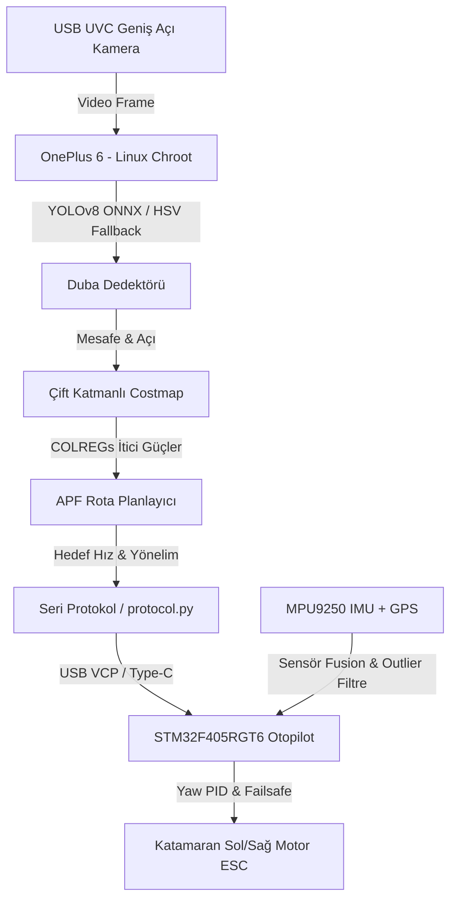

# İnsansız Deniz Aracı (İDA) Otonom Kontrol ve Seyrüsefer Sistemi

Bu proje, **TEKNOFEST 2026 İnsansız Deniz Aracı Şartnamesi** standartlarına tam uyumlu olarak geliştirilmiş; **OnePlus 6 (Yüksek Seviye Otonomi)** ve **STM32F405RGT6 (Alçak Seviye Otopilot)** donanımları üzerinde koşan, F-35 standartlarında kararlılıkta tasarlanmış komple bir otonom seyrüsefer kontrol yazılımıdır.

---

## 🛠️ Teknoloji Yığını (Tech Stack)

Sistem, kaynak yönetimi, işlem hızı ve donanımsal güvenlik gereksinimlerini karşılamak amacıyla katmanlı bir teknoloji yığınıyla inşa edilmiştir:

### 1. Yüksek Seviye Otonomi Katmanı (OnePlus 6 / Linux Chroot)
* **İşletim Sistemi / Çalışma Ortamı:**
  * **Ubuntu Base 22.04 LTS (ARM64):** Termux üzerinde çalışan minimal, yüksek performanslı Linux kök dosya sistemi (Chroot).
  * **Termux & Termux:Boot:** Güç verildiği an yazılımı başlatan otomatik önyükleme (autoboot) altyapısı.
  * **Android System Tweaks:** ADB WM (`window manager`) ve ekran yoğunluğu (`density`) optimizasyonları, Magisk arka plan servis koruması.
* **Programlama Dili:** Python 3.10
* **Kütüphaneler ve Altyapı:**
  * **OpenCV DNN (Headless):** Kamera akışı alma, video loglama ve derin öğrenme modellerinin GPU (Adreno 630 OpenCL) üzerinde koşturulması.
  * **NumPy:** Hızlı matris işlemleri, ızgara haritası (costmap) güncellemeleri ve potansiyel alan vektör hesaplamaları.
  * **PySerial:** Otomatik kurtarma (auto-reconnect) özellikli, asenkron ve düşük gecikmeli seri haberleşme.
  * **Ultralytics YOLOv8 (ONNX):** Duba tespiti için optimize edilmiş derin öğrenme model çıkarımı.

### 2. Alçak Seviye Kontrol Katmanı (STM32F405RGT6 / Bare-Metal)
* **İşletim Sistemi:** FreeRTOS (Çoklu görev yönetimi ve deterministik çalışma için).
* **Programlama Dili:** Bare-Metal C (C99 Standardı)
* **Donanım Hızlandırma ve Optimizasyonlar:**
  * **STM32 FPU (Floating Point Unit):** SCB CPACR registerları üzerinden donanımsal float PID hesaplama.
  * **ART Accelerator (Flash Cache/Prefetch):** 168 MHz SYSCLK hızında Flash bellek gecikmelerini sıfırlayan önbellek mekanizması.
  * **DMA (Direct Memory Access):** İşlemciyi meşgul etmeden seri port verilerini RAM dairesel tamponuna yazan USART DMA (NDTR register takipli).
  * **CRC16-ANSI:** İletişim paketlerinin veri bütünlüğünü doğrulayan sağlama algoritması.

### 3. Simülasyon ve Test Altyapısı
* **SITL (Software-in-the-Loop) Simulator:** Katamaran itki fiziğini, su sürüklenmesini, akıntı/rüzgar kuvvetlerini ve sanal kamera görüş alanını (FOV) simüle eden 2D OpenCV/Python test ortamı.

---

## 🛠️ Sistem Mimarisi ve Veri Akışı



---

## 📊 En Ufak Görev Dağılımı ve Görev Dağılım Matrisi

Projedeki yazılımsal ve donanımsal işlevlerin, kod dosyaları, sınıf/fonksiyon seviyesinde en küçük görev dağılımı aşağıdaki tabloda verilmiştir:

| Modül / Özellik | Alt Görev | Sorumlu Dosya / Sınıf | Çalışma Seviyesi | Açıklama |
| :--- | :--- | :--- | :--- | :--- |
| **Algılama (Perception)** | YOLO Model Çıkarımı | [detector.py](file:///c:/Users/Şahakan/Desktop/aydede/high_level/src/detector.py) -> `BuoyDetector.detect()` | Yüksek Seviye (Python) | YOLOv8 ONNX modelini çalıştırarak dubaların bounding box bilgilerini çıkarır. |
| | HSV Renk Bölütleme | [detector.py](file:///c:/Users/Şahakan/Desktop/aydede/high_level/src/detector.py) -> `BuoyDetector.hsv_fallback()` | Yüksek Seviye (Python) | Derin öğrenme başarısız olduğunda veya karanlıkta yedek HSV filtresiyle duba tespiti yapar. |
| | Lens Tıkanıklık Tespiti | [detector.py](file:///c:/Users/Şahakan/Desktop/aydede/high_level/src/detector.py) -> `BuoyDetector.check_lens()` | Yüksek Seviye (Python) | Kameraya su sıçraması, çamur veya mercek kapanmasını kontrast analiziyle saptar. |
| | Zamansal Doğrulama | [detector.py](file:///c:/Users/Şahakan/Desktop/aydede/high_level/src/detector.py) -> `TemporalFilter` | Yüksek Seviye (Python) | Dalgalardan dolayı dubaların anlık kaybolup görünmesindeki gürültüleri filtreler. |
| **Haritalama (Mapping)** | Costmap Izgara Güncelleme | [costmap.py](file:///c:/Users/Şahakan/Desktop/aydede/high_level/src/costmap.py) -> `LocalCostmap.update()` | Yüksek Seviye (Python) | Kamera tespitlerini İDA merkezli 2D egocentric doluluk haritasına (Occupancy Grid) işler. |
| | Kapı Kuvvetleri (Symmetric) | [costmap.py](file:///c:/Users/Şahakan/Desktop/aydede/high_level/src/costmap.py) -> `LocalCostmap.get_gate_forces()` | Yüksek Seviye (Python) | Çift turuncu duba kapılarından geçerken İDA'nın tam ortadan hizalanmasını sağlar. |
| | Engel İtme (COLREGs) | [costmap.py](file:///c:/Users/Şahakan/Desktop/aydede/high_level/src/costmap.py) -> `LocalCostmap.get_obstacle_forces()` | Yüksek Seviye (Python) | Sarı engellerden gelen itme kuvvetini 22° sancağa kırarak deniz trafik kurallarına uyum sağlar. |
| **Seyrüsefer (Navigation)** | Rota Planlama (APF) | [planner.py](file:///c:/Users/Şahakan/Desktop/aydede/high_level/src/planner.py) -> `APFPlanner.plan()` | Yüksek Seviye (Python) | Hedef çekim gücü ile engellerden gelen itim kuvvetlerini vektörel olarak birleştirir. |
| | Düzlem Geçiş Kontrolü | [planner.py](file:///c:/Users/Şahakan/Desktop/aydede/high_level/src/planner.py) -> `APFPlanner.plan()` (Along-Track) | Yüksek Seviye (Python) | Kapı çizgisi tam geçilmeden bir sonraki yol noktasına dönülmesini (erken dönüş) engeller. |
| | Enine Sapma Entegrali | [planner.py](file:///c:/Users/Şahakan/Desktop/aydede/high_level/src/planner.py) -> `self.cte_integrator` | Yüksek Seviye (Python) | Akıntı veya sert rüzgar sürüklemesini saptayıp zıt yönde dümen açısı hesaplar. |
| | Dönüş Hızı Koruması | [planner.py](file:///c:/Users/Şahakan/Desktop/aydede/high_level/src/planner.py) -> `angle_factor` | Yüksek Seviye (Python) | Keskin U dönüşlerinde katamaranın devrilmesini önlemek için hızı otomatik sınırlar. |
| **Görev Kontrol (FSM)** | Durum Makinesi | [mission_control.py](file:///c:/Users/Şahakan/Desktop/aydede/high_level/src/mission_control.py) -> `MissionController` | Yüksek Seviye (Python) | Nokta Takip, Engel Kaçınma, Kamikaze ve Failsafe durum geçişlerini koordine eder. |
| | Öngörülü Sanal Çit | [mission_control.py](file:///c:/Users/Şahakan/Desktop/aydede/high_level/src/mission_control.py) -> `Geofence` | Yüksek Seviye (Python) | İDA'nın mevcut hızıyla 2 saniye sonra 100m sınırını aşıp aşmayacağını kestirerek motorları kapatır. |
| | Failsafe Tetikleyicileri | [mission_control.py](file:///c:/Users/Şahakan/Desktop/aydede/high_level/src/mission_control.py) -> `Failsafe` | Yüksek Seviye (Python) | Düşük pil, GPS kaybı, telemetri kopması veya kamera tıkanmasında acil durum modunu tetikler. |
| **Sistem / Altyapı** | CPU Çekirdek Ataması | [main.py](file:///c:/Users/Şahakan/Desktop/aydede/high_level/src/main.py) | Yüksek Seviye (Python) | Seyrüsefer işlemlerini Snapdragon'un büyük Kryo Gold çekirdeklerine (affinity 4-7) kilitler. |
| | Otomatik Reconnect | [main.py](file:///c:/Users/Şahakan/Desktop/aydede/high_level/src/main.py) -> `Serial client loop` | Yüksek Seviye (Python) | Fiziksel USB temassızlıklarında seri bağlantıyı 1ms içinde otomatik olarak ayağa kaldırır. |
| | Çöp Toplayıcı (GC) Ayarı | [main.py](file:///c:/Users/Şahakan/Desktop/aydede/high_level/src/main.py) -> `gc.collect()` | Yüksek Seviye (Python) | Python'ın zamansız çöp toplama duraklamalarını (stop-the-world) engellemek için GC'yi manuel yönetir. |
| | Sistem Güç & Saat Yamaları | [optimize_system.sh](file:///c:/Users/Şahakan/Desktop/aydede/high_level/src/optimize_system.sh) | İşletim Sistemi (Bash) | USB askıya alma (autosuspend) kapatma, CPU Governor performance ayarı ve RF modem kapatma. |
| | Şarj / USB Boot Bypass | [setup_autoboot.sh](file:///c:/Users/Şahakan/Desktop/aydede/setup_autoboot.sh) | İşletim Sistemi (Bash) | Telefon kapalıyken USB kablosu (güç) takıldığı an doğrudan boot etmesini sağlayan şarj yaması. |
| **Donanım / Haberleşme** | Seri Paket Protokolü | [protocol.py](file:///c:/Users/Şahakan/Desktop/aydede/high_level/src/protocol.py) & [protocol.h](file:///c:/Users/Şahakan/Desktop/aydede/low_level/include/protocol.h) | Çift Katmanlı (C/Py) | CRC16 ANSI doğrulamalı paketleme ve telemetri ayrıştırma işlemlerini yürütür. |
| | DMA Dairesel Tampon | [main.c](file:///c:/Users/Şahakan/Desktop/aydede/low_level/src/main.c) -> `DMA2_Stream5` | Alçak Seviye (C) | UART DMA NDTR sayacıyla sıfır CPU yüküyle gelen seri verileri RAM dairesel arabelleğine yazar. |
| **Alçak Seviye Kontrol** | Yaw PID Hesaplama | [control.c](file:///c:/Users/Şahakan/Desktop/aydede/low_level/src/control.c) -> `PID_Update()` | Alçak Seviye (C) | Açı taşması (-180° / +180° sarmalaması) korumalı dümen açısı ve rota sabitleme PID hesabı. |
| | İtki Eşleme | [control.c](file:///c:/Users/Şahakan/Desktop/aydede/low_level/src/control.c) -> `Control_UpdateMotors()` | Alçak Seviye (C) | Planlanan hız ve yönelim komutlarını katamaranın Sol ve Sağ ESC/Fırçasız motor PWM sinyallerine böler. |
| | Donanımsal Watchdog | [safety.c](file:///c:/Users/Şahakan/Desktop/aydede/low_level/src/safety.c) -> `Safety_Check()` | Alçak Seviye (C) | Sinyal kaybı, RC kumanda kopması veya telefon çökmesi durumunda motorları kilitleyen emniyet halkası. |
| | Sensör Süzgeçleri | [sensors.c](file:///c:/Users/Şahakan/Desktop/aydede/low_level/src/sensors.c) | Alçak Seviye (C) | NMEA GPS verilerini ayrıştırır, MPU9250 IMU ve manyetometre verilerini tamamlayıcı filtreyle birleştirir. |

---

## 📂 Dosya Yapısı ve Kod Linkleri

* **[high_level/src/](file:///c:/Users/Şahakan/Desktop/aydede/high_level/src)** - Telefon Üzerinde Çalışan Üst Seviye Karar Katmanı
  * [main.py](file:///c:/Users/Şahakan/Desktop/aydede/high_level/src/main.py) - Giriş noktası. Thread yönetimi, USB reconnect, CPU Affinity ve bellek optimizasyonları.
  * [protocol.py](file:///c:/Users/Şahakan/Desktop/aydede/high_level/src/protocol.py) - STM32 ile telemetri ve komut paketlerini CRC16 ile eşleyen binary haberleşme modülü.
  * [telemetry_logger.py](file:///c:/Users/Şahakan/Desktop/aydede/high_level/src/telemetry_logger.py) - Bellek sızıntısı korumalı (OOM önleme kuyruklu) asenkron video, CSV ve JSON costmap loglayıcı.
  * [detector.py](file:///c:/Users/Şahakan/Desktop/aydede/high_level/src/detector.py) - ONNX YOLOv8 duba dedektörü, HSV renk bölütleme yedek filtresi ve mercek tıkanıklık koruması.
  * [costmap.py](file:///c:/Users/Şahakan/Desktop/aydede/high_level/src/costmap.py) - Yerel Occupancy Grid. Kapılar için dengeli, engeller için COLREGs uyumlu (sağa yönlendirmeli) itme üretimi.
  * [planner.py](file:///c:/Users/Şahakan/Desktop/aydede/high_level/src/planner.py) - Yapay Potansiyel Alanlar (APF) rota planlayıcı. Akıntı sürüklenmesine karşı CTE integral terimi ve kapılardan tam geçiş için Along-Track Plane Crossing mantığı.
  * [mission_control.py](file:///c:/Users/Şahakan/Desktop/aydede/high_level/src/mission_control.py) - Sonlu Durum Makinesi (FSM). 100m Öngörülü Sanal Çit koruması ve donanım failsafe kararları.
  * [optimize_system.sh](file:///c:/Users/Şahakan/Desktop/aydede/high_level/src/optimize_system.sh) - Android CPU governor sabitleme, rfkill modem kapatma, adb pencere boyutu ayarları.

* **[low_level/](file:///c:/Users/Şahakan/Desktop/aydede/low_level)** - STM32F405RGT6 Otopilot Kodları (Bare-Metal C)
  * [main.c](file:///c:/Users/Şahakan/Desktop/aydede/low_level/src/main.c) - DMA NDTR register okumalı dairesel arabellek çözücü, FPU donanım aktivasyonu ve ART Flash hızlandırıcı.
  * [control.c](file:///c:/Users/Şahakan/Desktop/aydede/low_level/src/control.c) - Açı sarmalamalı PID yaw kontrolü ve katamaran motor itki diferansiyel eşleyicisi.
  * [safety.c](file:///c:/Users/Şahakan/Desktop/aydede/low_level/src/safety.c) - Donanımsal arıza kilidi (latch), watchdogs, acil stop kesmeleri.
  * [sensors.c](file:///c:/Users/Şahakan/Desktop/aydede/low_level/src/sensors.c) - GPS parser, I2C kilitlenme kurtarma (9 clock darbesi), tamamlayıcı yön filtresi.

* **[scratch/](file:///c:/Users/Şahakan/Desktop/aydede/scratch)** - Test ve Doğrulama
  * [sitl_simulator.py](file:///c:/Users/Şahakan/Desktop/aydede/scratch/sitl_simulator.py) - Katamaran fiziği, akıntı sürüklemesi, sanal lidar/kamera görüşü içeren 2D görsel simülatör.
  * [test_gate_navigation.py](file:///c:/Users/Şahakan/Desktop/aydede/scratch/test_gate_navigation.py) - Along-track kapı geçiş mantığının dikey eksende doğruluğunu ölçen headless test betiği.

---

## 🌊 Otonom Sistemin Suda Karşılaştığı 10 Kötü Senaryo Koruması

İDA'nın fiziksel testlerde batmasını veya kontrolden kaçmasını önlemek üzere tasarlanan 10 kritik koruma mekanizması:
1. **GPS Konum Sıçraması (Jitter):** Dinamik dt tabanlı outlier süzgeciyle 6.0 m/s'den hızlı yapay yer değişimleri elenir.
2. **Pusula Manyetik Bozulması:** Metal gövde veya manyetik alan nedeniyle pusula saptığında, tekne hareket halindeyken GPS COG (Course Over Ground) verisi referans yön olarak pusulayı düzeltir.
3. **I2C Hattı Kilitlenmesi (Sensor Crash):** MPU9250 okumalarında kilitlenme yaşanırsa, SCL pinine donanımsal 9 clock darbesi gönderilerek hat otomatik resetlenir.
4. **Rüzgar/Akıntı Sürüklemesi:** Rota çizgisinden sürüklenmeler planlayıcı içindeki Enine Sapma Entegrali (CTE) ile saptanarak akıntıya karşı dirençli yön komutu üretilir.
5. **Kamera Merceği Kapanması:** Görüntü analiziyle kontrast ve parlaklık sürekli izlenerek kameranın tıkanması saptanır ve güvenli moda (`FAILSAFE`) geçilir.
6. **Dalgalardan Anlık Duba Kayıpları:** Dubaların 5 ardışık kareden en az 3'ünde görülme şartı (Temporal Filter) ile dalgaların duba kapatma gürültüleri elenir.
7. **Haberleşme Kablosu Çıkması / Donma:** 500 ms boyunca telefondan veri paketi gelmezse STM32 otopilotu motor güçlerini anında keser.
8. **Anlık Pil Voltaj Çökmesi (Sag):** Motorların ani tork çekmesiyle pilde yaşanan dalgalanmalar EMA filtresiyle süzülür, kesintisiz 3s düşük voltaj olmadıkça motorlar kapatılmaz.
9. **Yosun Dolanması/Pervane Sıkışması:** Yüksek dönüş veya hız komutuna rağmen teknenin dönemediği (yaw_rate < 2.0 deg/s) saptanırsa motor korumak için sistem kilitlenir.
10. **Teknenin Kaçıp Gitmesi (Flyaway):** Kalkış noktasından 100 metrelik Geofence sınırı aşılmadan 2 sn önce İDA'nın mevcut hızıyla frenleme mesafesi hesaplanır ve acil stop tetiklenir.

---

## 🚀 SITL Simülatörünü Çalıştırma

Geliştirilen tüm algoritmaları göle veya denize inmeden önce test etmek için 2D fizik simülatörünü çalıştırabilirsiniz.

### 1. Kütüphaneleri Yükleyin
```bash
pip install opencv-python numpy
```

### 2. Simülatörü Başlatın
```bash
python scratch/sitl_simulator.py
```
* **Kırmızı duba:** Kamikaze hedefini, **Sarı dubalar** kaçınılması gereken engelleri (COLREGs uyumlu sağdan kaçış), **Çift Turuncu dubalar** ise kapı sınırlarını temsil eder.
* İDA kapıların tam ortasından simetrik olarak hizalanarak geçer.
* Simülasyon penceresi etkinken çıkış yapmak için `q` tuşuna basın.

---

## 📦 Tek Klasörde Çevrimdışı Linux Chroot Kurulumu (`phone_assets`)

İDA otonomi sisteminin telefonda çalışması için gereken tüm sistem bağımlılıkları ve **Ubuntu Base 22.04 ARM64** imajı tek bir klasörde (`phone_assets/`) bir araya getirilmiştir. Bu sayede telefonda kurulum yaparken internet bağlantısına ihtiyaç duyulmaz.

### Çevrimdışı Kurulum Adımları:
1. Tüm `aydede` klasörünü telefonun Termux ev dizinine kopyalayın (`/data/data/com.termux/files/home/aydede`).
2. Termux'ta root yetkisi alarak kurulum betiğini çalıştırın:
   ```bash
   su
   sh /data/data/com.termux/files/home/aydede/phone_assets/setup_chroot.sh
   ```
3. Kurulum bittiğinde otonomi sistemi `/data/local/ubuntu` dizini altında tamamen hazır olacaktır.
4. Chroot ortamına manuel girmek veya donanımları bağlamak için:
   * Donanımları bağlamak için: `su -c "sh /data/data/com.termux/files/home/aydede/phone_assets/chroot_mount.sh mount"`
   * Chroot'a girmek için: `su -c "chroot /data/local/ubuntu /bin/bash"`
