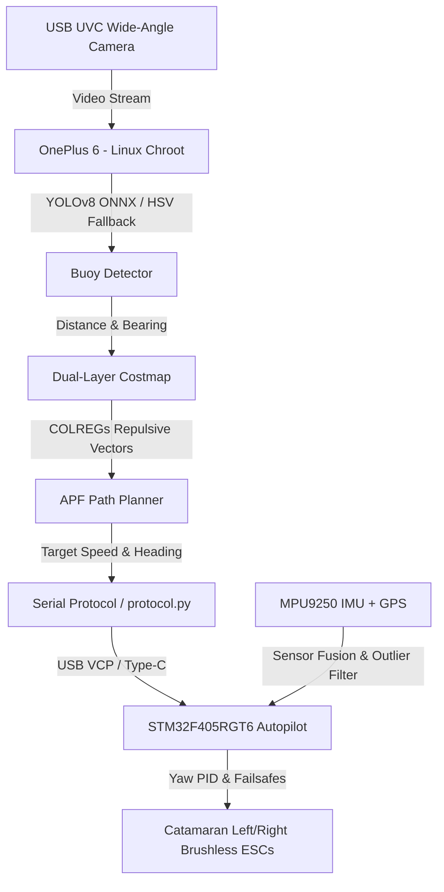

# Autonomous Autonomous Surface Vehicle (ASV) Navigation & Control System

[Türkçe Sürüm / Turkish Version](README_TR.md)

This repository contains a production-grade, highly reliable autonomous navigation and control software suite designed for an **Autonomous Surface Vehicle (ASV) / Catamaran**. The system is fully compliant with the **TEKNOFEST 2026 ASV Competition Specifications** and features a dual-layer architecture: a **High-Level Autonomy Layer (Ubuntu Chroot on ARM64)** and a **Low-Level Autopilot Layer (Bare-metal C on STM32F405RGT6 running FreeRTOS)**, engineered to meet military-grade robustness and failsafe standards.

---

## 🛠️ Technology Stack

The project features a decoupled, hierarchical hardware and software topology designed to optimize processing throughput, real-time safety, and compute resource allocation:

### 1. High-Level Autonomy Layer (OnePlus 6 / Linux Chroot)
* **OS / Runtime Environment:**
  * **Ubuntu Base 22.04 LTS (ARM64):** Runs as a lightweight chroot rootfs inside Android via Termux.
  * **Termux & Termux:Boot:** Provides cold boot automation, executing startup scripts immediately upon device power-up.
  * **Android System Tweaks:** ADB Window Manager adjustments, customized screen density profiles, and Magisk-managed background service locks to prevent CPU throttling.
* **Programming Language:** Python 3.10
* **Libraries & Core Frameworks:**
  * **OpenCV Headless (with OpenCL Acceleration):** Handles camera streaming, video encoding/logging, and deep learning model executions using the Adreno 630 GPU.
  * **NumPy:** Offloads matrix math, costmap updates, and vector calculations for path planning.
  * **PySerial:** Asynchronous serial link management with sub-millisecond connection drop recovery.
  * **Ultralytics YOLOv8 (ONNX format):** High-speed object detection for buoy classification.

### 2. Low-Level Control Layer (STM32F405RGT6 / Bare-metal C)
* **Real-time Operating System:** FreeRTOS (Ensures deterministic task scheduling and low jitter).
* **Programming Language:** Bare-metal C (C99 standard compliance)
* **Hardware Acceleration & Optimizations:**
  * **FPU (Floating Point Unit):** Hardware-accelerated PID math using native FPU registers.
  * **ART Accelerator:** Caches Flash pre-fetch instructions at 168 MHz SYSCLK, bypassing memory wait states.
  * **DMA (Direct Memory Access):** Non-blocking USART ring buffer using DMA transfer streams (monitored by NDTR register tracking).
  * **CRC16-ANSI:** Computes Modbus-compliant packet checksums in hardware.

### 3. Simulation & Validation Environment
* **SITL (Software-in-the-Loop) Simulator:** A 2D physics-based catamaran simulator modeling drag forces, water currents, randomized wind gusts (EMA-filtered), and virtual camera FOV boundaries.

---

## 🛠️ System Architecture & Data Flow



---

## 📊 Work Breakdown & Task Allocation Matrix

The breakdown of high-level and low-level software responsibilities, mapped directly to their respective source files and class components:

| Module / Feature | Sub-task | Source File / Class | Layer | Description |
| :--- | :--- | :--- | :--- | :--- |
| **Perception** | YOLO Inference | [detector.py](file:///c:/Users/Şahakan/Desktop/aydede/high_level/src/detector.py) -> `BuoyDetector.detect()` | High-Level (Python) | Executes YOLOv8 ONNX model for real-time bounding box extraction of buoys. |
| | HSV Color Segmentation | [detector.py](file:///c:/Users/Şahakan/Desktop/aydede/high_level/src/detector.py) -> `BuoyDetector.hsv_fallback()` | High-Level (Python) | Fallback algorithm using BGR-to-HSV filtering during dark/glare edge-cases. |
| | Lens Occlusion Check | [detector.py](file:///c:/Users/Şahakan/Desktop/aydede/high_level/src/detector.py) -> `BuoyDetector.check_lens()` | High-Level (Python) | Monitors camera lens for blockage, dirt, or splash occlusion using contrast variance analysis. |
| | Temporal Validation | [detector.py](file:///c:/Users/Şahakan/Desktop/aydede/high_level/src/detector.py) -> `TemporalFilter` | High-Level (Python) | Filters out high-frequency noise from wave crests using a multi-frame rolling validation gate. |
| **Mapping** | Costmap Grid Update | [costmap.py](file:///c:/Users/Şahakan/Desktop/aydede/high_level/src/costmap.py) -> `LocalCostmap.update()` | High-Level (Python) | Generates a 2D egocentric occupancy grid map updated with camera detections and ego-motion warping. |
| | Symmetric Gate Force | [costmap.py](file:///c:/Users/Şahakan/Desktop/aydede/high_level/src/costmap.py) -> `LocalCostmap.get_gate_forces()` | High-Level (Python) | Generates attractive/centering forces when navigating between gate-buoy pairs. |
| | COLREGs Obstacle Force | [costmap.py](file:///c:/Users/Şahakan/Desktop/aydede/high_level/src/costmap.py) -> `LocalCostmap.get_obstacle_forces()` | High-Level (Python) | Implements asymmetric repulsive fields (22° starboard rotation) for maritime traffic rules compliance. |
| **Navigation** | Path Planning (APF) | [planner.py](file:///c:/Users/Şahakan/Desktop/aydede/high_level/src/planner.py) -> `APFPlanner.plan()` | High-Level (Python) | Merges attractive target fields and repulsive obstacle vectors into a single navigation vector. |
| | Waypoint Plane Check | [planner.py](file:///c:/Users/Şahakan/Desktop/aydede/high_level/src/planner.py) -> `APFPlanner.plan()` (Along-Track) | High-Level (Python) | Prevents premature turning at gates by checking along-track plane crossings. |
| | Cross-Track Integration | [planner.py](file:///c:/Users/Şahakan/Desktop/aydede/high_level/src/planner.py) -> `self.cte_integrator` | High-Level (Python) | Integrates cross-track error (CTE) over time to counteract drift from water currents and wind. |
| | Cornering Speed Limit | [planner.py](file:///c:/Users/Şahakan/Desktop/aydede/high_level/src/planner.py) -> `angle_factor` | High-Level (Python) | Limits linear speed during sharp U-turns to prevent catamaran capsizing. |
| **Mission Control (FSM)**| Finite State Machine | [mission_control.py](file:///c:/Users/Şahakan/Desktop/aydede/high_level/src/mission_control.py) -> `MissionController` | High-Level (Python) | Orchestrates transitions between Waypoint Follow, Obstacle Avoidance, Kamikaze Charge, and Failsafe states. |
| | Predictive Geofence | [mission_control.py](file:///c:/Users/Şahakan/Desktop/aydede/high_level/src/mission_control.py) -> `Geofence` | High-Level (Python) | Checks if current trajectory will cross the 100m home fence in the next 2s. Also manages 85m soft-fail slowdown. |
| | Failsafe Triggers | [mission_control.py](file:///c:/Users/Şahakan/Desktop/aydede/high_level/src/mission_control.py) -> `Failsafe` | High-Level (Python) | Monitors low voltage, GPS lock loss, telemetry timeout, and camera crashes to trigger emergency modes. |
| **System Infrastructure** | CPU Affinity Lock | [main.py](file:///c:/Users/Şahakan/Desktop/aydede/high_level/src/main.py) | High-Level (Python) | Pins high-priority autonomy threads to Snapdragon's Kryo Gold cores (cores 4-7). |
| | Auto Reconnect | [main.py](file:///c:/Users/Şahakan/Desktop/aydede/high_level/src/main.py) -> `Serial client loop` | High-Level (Python) | Performs sub-millisecond connection recoveries on serial USB VCP lines. |
| | Manual GC Tuning | [main.py](file:///c:/Users/Şahakan/Desktop/aydede/high_level/src/main.py) -> `gc.collect()` | High-Level (Python) | Manually invokes garbage collection during idle periods to prevent timing jitter (stop-the-world spikes). |
| | OS Optimization Script | [optimize_system.sh](file:///c:/Users/Şahakan/Desktop/aydede/high_level/src/optimize_system.sh) | OS Layer (Bash) | Disables USB autosuspend, sets CPU governor to 'performance', and powers off cellular/RF hardware. |
| | Boot-on-Power Patch | [setup_autoboot.sh](file:///c:/Users/Şahakan/Desktop/aydede/setup_autoboot.sh) | OS Layer (Bash) | Configures Android bootloader triggers to boot the OS immediately upon charger/USB power attachment. |
| **Communication Link** | Packet Protocol | [protocol.py](file:///c:/Users/Şahakan/Desktop/aydede/high_level/src/protocol.py) & [protocol.h](file:///c:/Users/Şahakan/Desktop/aydede/low_level/include/protocol.h) | Dual-Layer (C/Py) | Packs data with Modbus CRC16-Modbus checksum validation and handles version verification. |
| | DMA Circular Buffer | [main.c](file:///c:/Users/Şahakan/Desktop/aydede/low_level/src/main.c) -> `DMA2_Stream5` | Low-Level (C) | Feeds received bytes into the parser via circular USART DMA without CPU intervention. |
| **Low-Level Control** | Yaw PID Controller | [control.c](file:///c:/Users/Şahakan/Desktop/aydede/low_level/src/control.c) -> `PID_Update()` | Low-Level (C) | Executes yaw rate and orientation PID calculations with wrap-around (-180° to +180°) error correction. |
| | Thruster Thrust Mixer | [control.c](file:///c:/Users/Şahakan/Desktop/aydede/low_level/src/control.c) -> `Control_UpdateMotors()` | Low-Level (C) | Converts target speed and heading commands into differential ESC PWM pulse durations. |
| | Hardware Watchdogs | [safety.c](file:///c:/Users/Şahakan/Desktop/aydede/low_level/src/safety.c) -> `Safety_Check()` | Low-Level (C) | Evaluates task check-ins, RC links, and telemetry streams to block outputs if a crash is detected. |
| | Sensor Filters | [sensors.c](file:///c:/Users/Şahakan/Desktop/aydede/low_level/src/sensors.c) | Low-Level (C) | Parses NMEA GPS strings and fuses MPU9250 IMU/Compass measurements via complementary filtering. |

---

## 📂 Repository Structure

* **[high_level/src/](file:///c:/Users/Şahakan/Desktop/aydede/high_level/src)** - High-Level Decision Autonomy (Runs on Phone SBC)
  * [main.py](file:///c:/Users/Şahakan/Desktop/aydede/high_level/src/main.py) - Main entrypoint. Handles threading, USB auto-reconnections, CPU Affinity settings, and GC overrides.
  * [protocol.py](file:///c:/Users/Şahakan/Desktop/aydede/high_level/src/protocol.py) - Binary packet encoder/decoder using CRC16 validation and version matching.
  * [telemetry_logger.py](file:///c:/Users/Şahakan/Desktop/aydede/high_level/src/telemetry_logger.py) - Memory-safe (queue-backed) logger writing MP4 frames, CSV telemetry logs, and JSON costmap frames.
  * [detector.py](file:///c:/Users/Şahakan/Desktop/aydede/high_level/src/detector.py) - Yolov8 model runtime wrapper, HSV threshold segmentation, and lens blockage checking.
  * [costmap.py](file:///c:/Users/Şahakan/Desktop/aydede/high_level/src/costmap.py) - Local occupancy grid map generating symmetric attractive fields for gates and asymmetric COLREGs fields.
  * [planner.py](file:///c:/Users/Şahakan/Desktop/aydede/high_level/src/planner.py) - Artificial Potential Fields (APF) navigator with Cross-Track Error integration and along-track check planes.
  * [mission_control.py](file:///c:/Users/Şahakan/Desktop/aydede/high_level/src/mission_control.py) - Central Finite State Machine. Implements predictive geofences and low-voltage triggers.
  * [optimize_system.sh](file:///c:/Users/Şahakan/Desktop/aydede/high_level/src/optimize_system.sh) - OS optimizations (performance CPU profile, disabling power suspend and cellular radios).

* **[low_level/](file:///c:/Users/Şahakan/Desktop/aydede/low_level)** - STM32F405RGT6 Autopilot Code (Bare-metal C)
  * [main.c](file:///c:/Users/Şahakan/Desktop/aydede/low_level/src/main.c) - FreeRTOS task setups, USART DMA circular buffer parsing, and FPU/ART cache initializations.
  * [control.c](file:///c:/Users/Şahakan/Desktop/aydede/low_level/src/control.c) - Angular error PID solvers and differential motor thruster mixers.
  * [safety.c](file:///c:/Users/Şahakan/Desktop/aydede/low_level/src/safety.c) - Independent Watchdog (IWDG) task checkers, hardware failsafes, and EXTI interrupt binders.
  * [sensors.c](file:///c:/Users/Şahakan/Desktop/aydede/low_level/src/sensors.c) - NMEA GPS decoders, I2C recovery clocks, and complementary orientation filters.

* **[scratch/](file:///c:/Users/Şahakan/Desktop/aydede/scratch)** - Verification & SITL Test Scripts
  * [sitl_simulator.py](file:///c:/Users/Şahakan/Desktop/aydede/scratch/sitl_simulator.py) - 2D visual SITL simulator modeling catamaran drag, wind gusts, water current drift, and virtual FOV.
  * [test_gate_navigation.py](file:///c:/Users/Şahakan/Desktop/aydede/scratch/test_gate_navigation.py) - Headless check script validating along-track gate transitions.

---

## 🌊 Failsafe & Disaster Recovery Systems

Ten robust software mitigation strategies to protect the vessel from physical damage and water entry:
1. **GPS Position Jitter Filter:** Filters out coordinate jumps larger than 6.0 m/s using a dynamic dt-based window.
2. **Magnetic Deviation Correction:** In the event of magnetic interference from on-board electronics, uses GPS Course Over Ground (COG) to correct compass headings dynamically.
3. **I2C Sensor Lockup Recovery:** Automatically resets the sensor SCL line by toggling 9 clock pulses if IMU read blockages are detected.
4. **Current/Wind Drift Integration:** Active CTE (Cross-Track Error) integration computes correction angles to steer back on path in high winds or strong currents.
5. **Camera Lens Blockage Failsafe:** Detects camera blockage, salt water splash, or mud on the lens via variance analysis and falls back to a safe `FAILSAFE` state.
6. **Temporal Detection Filter:** Eliminates false alarms and camera flicker caused by sun reflections or wave crests by validating detections across 5 consecutive frames.
7. **USB Cable Drop Failsafe:** If the phone-to-STM32 USB cable is disconnected or packets stop for >500ms, the STM32 kills thruster outputs immediately.
8. **Battery Sag Protection:** Utilizes EMA filtering to bypass short-term voltage sags caused by sudden motor torque loads; only shuts down motor output if low voltage persists for >3s.
9. **Propeller Jam / Entanglement Failsafe:** Detects zero rotation rates under high yaw thrust conditions (indicating seaweed or rope entanglement) and stops thrusters to protect motors.
10. **Flyaway Prevention Geofence:** Employs a predictive home geofence. If current speed will cross the 100m home boundary in the next 2s, it drops to a safe return speed or cuts power.

---

## 🚀 Running the SITL Simulator

You can test all autonomy algorithms and FSM behaviors in the 2D SITL simulator environment:

### 1. Install Dependencies
```bash
pip install opencv-python numpy
```

### 2. Run the Simulator
```bash
python scratch/sitl_simulator.py
```
* **Red Buoy:** The Kamikaze Target.
* **Yellow Buoys:** Obstacles to avoid (following COLREGs rules by steering starboard).
* **Turround Gate Pairs:** Path kapıları which the ASV navigates through.
* Press `q` to terminate the simulator run.

---

## 📦 Offline Chroot Environment Setup (`phone_assets`)

To facilitate on-field terminal operations without cellular internet connections, a precompiled **Ubuntu Base 22.04 ARM64** rootfs and required dependencies are bundled under `phone_assets/`.

### Setup Steps:
1. Copy the `aydede` folder into your Termux home directory (`/data/data/com.termux/files/home/aydede`).
2. Run the root installer script in Termux:
   ```bash
   su
   sh /data/data/com.termux/files/home/aydede/phone_assets/setup_chroot.sh
   ```
3. Once completed, the Ubuntu shell will be configured under `/data/local/ubuntu`.
4. Command utilities:
   * To mount Android device nodes: `su -c "sh /data/data/com.termux/files/home/aydede/phone_assets/chroot_mount.sh mount"`
   * To enter the chroot root environment: `su -c "chroot /data/local/ubuntu /bin/bash"`

---

## 🛡️ STM32 Health & Safety Management (Safety Management)

Vessel safety is monitored by low-level FreeRTOS watchdog routines:

1. **Task-Level Watchdog & IWDG:**
   * An Independent Watchdog (IWDG) is initialized in hardware.
   * `StartTelemetryTask`, `StartNavigationTask`, and `StartSafetyTask` must set their health flags within their run loops by calling `safety_feed_watchdog()`.
   * The high-priority `SafetyTask` monitors task timings. If any task locks or freezes, the hardware IWDG will not be refreshed, triggering a system-wide STM32 hard reset within 2.0 seconds.
2. **Physical Emergency Stop (PC13 EXTI):**
   * Connected to the external red E-stop button via pin `PC13`.
   * Triggering the pin generates an EXTI interrupt (`EXTI15_10_IRQHandler`), instantly locking PWM signals to `1500us` (stop) and transitioning the state machine to `MODE_EMERGENCY`.
3. **Timeout Failsafes:**
   * **Telemetry Dropout:** If no `MSG_PHONE_COMMANDS` package is received for >500ms, the autopilot automatically shuts down thruster outputs.
   * **RC Loss of Signal:** If the RC receiver asserts its failsafe pin, control falls back to autonomous failsafe procedures.

---

## 🗺️ Versioning & Protocol Roadmap

The communication interface maintains a synchronized schema version between the STM32 (`protocol.h`) and Python (`protocol.py`):

* **Protocol Versioning:** Headers include a 1-byte `PROTOCOL_VERSION = 0x01` byte following sync characters. Packets matching incorrect version hashes are immediately dropped.
* **Feature Roadmap:**
  * `v1.0.0` (Active): Basic waypoint navigation, APF vectoring, dual occupancy costmaps, GCS listener, and telemetry thruster PWM reporting.
  * `v1.1.0` (Planned): Multi-vessel swarm coordination using custom MAVLink bridges (`mavlink_bridge.py`).
  * `v1.2.0` (Planned): LIDAR / Radar raw scan ingestion into local costmap cost matrices.

---

## 💾 STM32 Firmware Upgrade & Rollback (DFU Guide)

Autopilot firmware flashing can be performed via built-in bootloader pipelines:

### Method A: Flashing over USB DFU Mode (Recommended)
1. Power down the autopilot board.
2. Tie the `BOOT0` pin to `3.3V` (or flip the BOOT switch to ON).
3. Connect the board to your PC via micro-USB. It will boot into DFU mode.
4. Launch **STM32CubeProgrammer** and change the connection protocol to **USB**. Click **Connect**.
5. Select the build binary: `STM32/build/aydede.bin` (or a backup `rollback.bin` image).
6. Click **Start Programming**.
7. Once finished, disconnect, ground the `BOOT0` pin (set to GND/OFF), and power cycle.

### Method B: Flashing via UART1 FTDI Programmer
1. Connect FTDI RX to STM32 `PA9` (TX1) and FTDI TX to STM32 `PA10` (RX1). Share common Ground (GND).
2. Set `BOOT0` to `3.3V` and power up the board.
3. In STM32CubeProgrammer, select **UART**, choose the target COM port, set baud rate to 115200, and click **Connect**.
4. Select the target binary and initiate the download.
5. Ground `BOOT0` and reset the board.
